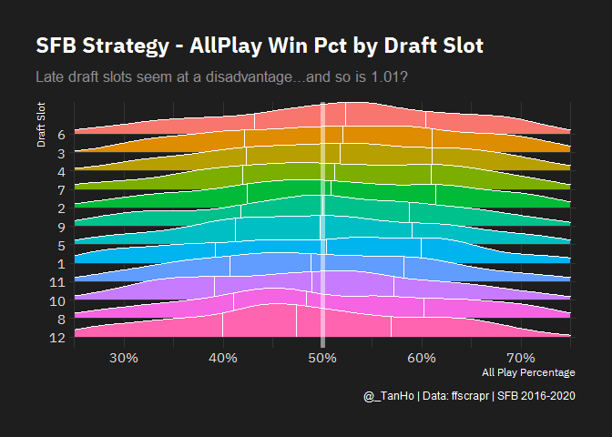

SFB Draft Slots
================
Tan Ho
2021-06-18

``` r
library(tidyverse)
library(arrow)
library(hrbrthemes)
library(here)

import_plex_sans()
```

``` r
drafts <- arrow::open_dataset(here("data/draft/")) %>% 
  filter(round == "01", sfb_type == "official") %>% 
  collect()

standings <- arrow::open_dataset(here("data/standings/")) %>% 
  filter(sfb_type == "official") %>% 
  collect()

draft_slot_results <- standings %>% 
  select(year, league_id, franchise_id, franchise_name, allplay_winpct) %>% 
  left_join(
    drafts %>% select(year, league_id,franchise_id, overall),
    by = c("year","league_id","franchise_id")
  ) %>% 
  group_by(overall) %>% 
  mutate(median_ap = median(allplay_winpct,na.rm=TRUE)) %>% 
  ungroup() %>% 
  mutate(draft_slot = overall %>% as.factor() %>% fct_reorder(desc(median_ap)))
  

draft_slot_results %>% 
  ggplot(aes(x = allplay_winpct, y = fct_rev(draft_slot), fill = draft_slot)) + 
  ggridges::geom_density_ridges(
    # stat = "binline",
    quantile_lines = TRUE,
    # bins = 30,
    bandwidth = 0.03,
    colour = 'white') +
  geom_vline(xintercept = 0.5, size = 2, alpha = 0.5, color = "white") +
  theme_modern_rc(base_family = "IBM Plex Sans") + 
  theme(
    legend.position = "none",
    plot.title.position = "plot"
  ) + 
  scale_x_percent(limits = c(0.25,0.75)) +
  xlab("All Play Percentage")+
  ylab("Draft Slot") +
  labs(
    title = "SFB Strategy - AllPlay Win Pct by Draft Slot",
    subtitle = "QB and WR centric strategies seem to be leading the way",
    caption = "@_TanHo | Data: ffscrapr | SFB 2016-2020"
  )
```

<!-- -->
