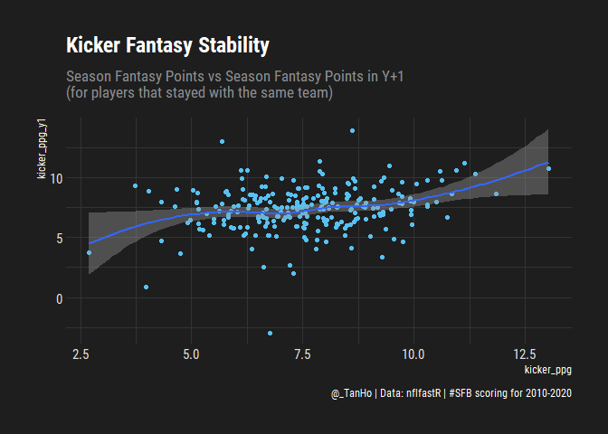

SFB11 - scoring, vorp, kickers
================
Tan Ho
2021-05-23

## Intro

The offical SFB11 rules are \~ finalized:
<https://scottfishbowl.com/2021/rules.php>

The scoring system for 2021 is very similar to the scoring for 2020,
with the addition of kickers as a scoring options.

Use ffscrapr + nflfastR data to reconstruct scoring

## Questions

-   Is kicker scoring (raw points) stable, year over year correlations?

-   Team-level kicker value-over-replacement

-   Is kicker value over replacement kicker stable, YOY correlations?

-   Compare to QB/RB/WR/TE YOY correlations?

-   Average scoring for kickers over the years, but also the
    variance/range of points per game (from best kicker to worst kicker)

## Packages

``` r
suppressPackageStartupMessages({
  library(ffscrapr)
  library(nflfastR)
  library(tidyverse)
  library(janitor)
  library(lubridate)
  
  library(ggridges)
  library(hrbrthemes)
  
  options(dplyr.summarise.inform = FALSE)
  
})

knitr::opts_chunk$set(echo = TRUE)
```

``` r
sfb_template_conn <- mfl_connect(2021, 
                                 48911, 
                                 user_agent = "dynastyprocess/sfb_research")

sfb_weekly_scoring <- ff_playerscores(conn = sfb_template_conn,
                                      season = 2019:2020,
                                      week = 1:17)

scoring_history <- nflfastr_weekly()

pbp <- load_pbp(2010:2020, qs = TRUE)
```

    ## i It is recommended to use parallel processing when trying to load multiple seasons.
    ##   Please consider running `future::plan("multisession")`!
    ##   Will go on sequentially...

``` r
kick_pbp <- pbp %>% 
  filter(play_type %in% c("field_goal", "extra_point"),
         is.na(two_point_conv_result)) %>% 
  select(
    season, week, kicker_player_id, kicker_player_name, team = posteam,
    field_goal_result, extra_point_result, kick_distance
  )

kick_week <- kick_pbp %>% 
  group_by(season, week, kicker_player_id, team) %>% 
  summarise(
    kicker_player_name = nflfastR:::custom_mode(kicker_player_name),
    field_goal_attempts = sum(field_goal_result %in% c("made","missed","blocked"), na.rm = TRUE), 
    field_goal_distance = sum(kick_distance * (field_goal_result == "made"), na.rm = TRUE),
    field_goal_misses = sum(field_goal_result %in% c("missed", "blocked"), na.rm = TRUE),
    extra_point_attempts = sum(extra_point_result %in% c("good","made","missed","blocked"), na.rm = TRUE), 
    extra_points_made = sum(extra_point_result %in% c("good", "made"), na.rm = TRUE),
    extra_points_missed = sum(extra_point_result %in% c("missed", "blocked"), na.rm = TRUE)
  ) %>% 
  ungroup() %>% 
  mutate(
    kicker_points = field_goal_distance * 0.1 - 3 * field_goal_misses + extra_points_made - extra_points_missed
  )

kick_season <- kick_week %>% 
  filter(week <=17) %>% 
  group_by(season, kicker_player_id, kicker_player_name, team) %>% 
  summarise(
    games = n(),
    across(everything(),sum),
    ) %>% 
  ungroup() %>% 
  mutate(
    kicker_ppg = kicker_points / games
  )
```

# Player on same team, next season/YOY

``` r
kick_season_next <- kick_season %>% 
  mutate(
    next_year = season + 1
  ) %>% 
  inner_join(
    x = ., 
    y = kick_season %>% 
      select(season, kicker_player_id, kicker_points_y1 = kicker_points,team, kicker_ppg_y1 = kicker_ppg),
    by = c("next_year"="season","kicker_player_id", "team")
  )

kick_season_next %>% 
  ggplot(aes(x = kicker_ppg, y = kicker_ppg_y1)) +
  geom_point() +
  geom_smooth() + 
  labs(
    title = "Kicker Fantasy Stability",
    subtitle = "Season Fantasy Points vs Season Fantasy Points in Y+1 \n(for players that stayed with the same team)",
    caption = "@_TanHo | Data: nflfastR | #SFB scoring for 2010-2020"
  ) + 
  hrbrthemes::theme_modern_rc()
```

    ## `geom_smooth()` using method = 'loess' and formula 'y ~ x'

<!-- -->

``` r
cor(kick_season_next$kicker_ppg,
    kick_season_next$kicker_ppg_y1)
```

    ## [1] 0.2411879

There isn’t much stability of points per game for individual kickers who
return to the same team next year - the correlation is \~ 0.24.

Don’t forget that this is a selection bias for kickers - if team kept
their kicker from previous year, that means the kicker is at least
passable!

Comparatively, QB/RB/WR/TE PPG YOY correlation is more like 0.4-0.5 -
and that’s not even relying on them returning to the same team.

# Team kicker, next season/YOY

``` r
team_kick_week <-  kick_pbp %>% 
  group_by(season, week, team) %>% 
  summarise(
    field_goal_attempts = sum(field_goal_result %in% c("made","missed","blocked"), na.rm = TRUE), 
    field_goal_distance = sum(kick_distance * (field_goal_result == "made"), na.rm = TRUE),
    field_goal_misses = sum(field_goal_result %in% c("missed", "blocked"), na.rm = TRUE),
    extra_point_attempts = sum(extra_point_result %in% c("good","made","missed","blocked"), na.rm = TRUE), 
    extra_points_made = sum(extra_point_result %in% c("good", "made"), na.rm = TRUE),
    extra_points_missed = sum(extra_point_result %in% c("missed", "blocked"), na.rm = TRUE)
  ) %>% 
  ungroup() %>% 
  mutate(
    kicker_points = field_goal_distance * 0.1 - 3 * field_goal_misses + extra_points_made - extra_points_missed
  )

team_kick_season <- team_kick_week %>% 
  filter(week <=17) %>% 
  group_by(season, team) %>% 
  summarise(
    games = n(),
    across(everything(),sum),
    ) %>% 
  ungroup() %>% 
  mutate(
    kicker_ppg = kicker_points / games
  )

team_kick_season_next <- team_kick_season %>% 
  mutate(
    next_year = season + 1
  ) %>% 
  inner_join(
    x = ., 
    y = kick_season %>% 
      select(season, team, kicker_points_y1 = kicker_points, kicker_ppg_y1 = kicker_ppg),
    by = c("next_year"="season","team")
  )

team_kick_season_next %>% 
  ggplot(aes(x = kicker_ppg, y = kicker_ppg_y1)) +
  geom_point() +
  geom_smooth() + 
  labs(
    title = "Team Kicking Fantasy Stability",
    subtitle = "Season Fantasy Points vs Season Fantasy Points in Y+1",
    caption = "@_TanHo | Data: nflfastR | #SFB scoring for 2010-2020"
  ) + 
  hrbrthemes::theme_modern_rc()
```

    ## `geom_smooth()` using method = 'loess' and formula 'y ~ x'

<!-- -->

``` r
cor(team_kick_season_next$kicker_ppg,
    team_kick_season_next$kicker_ppg_y1)
```

    ## [1] 0.1457237

## Variance of weekly kicker scoring

``` r
kick_season_ranks <- kick_season %>% 
  filter(games > 4, !is.na(kicker_player_id)) %>% 
  group_by(season) %>% 
  mutate(season_rank = rank(desc(kicker_ppg),ties.method = "min")) %>% 
  ungroup() %>% 
  arrange(season,season_rank)

kick_week_rank <- kick_week %>% 
  left_join(
    kick_season_ranks %>% select(season, kicker_player_id, season_rank), 
    by = c("season","kicker_player_id")
  )

kick_week_rank %>% 
  filter(
    season_rank <= 16
  ) %>% 
  mutate(season_rank = fct_rev(as.factor(season_rank))) %>% 
  ggplot(aes(x = kicker_points, y = season_rank, fill = season_rank)) +
  geom_density_ridges(
    stat = "binline",
    bins = 50,
    colour = "white"
  ) + 
  coord_cartesian(xlim = c(-5, 30)) +
  xlab("Weekly Fantasy Points") +
  ylab("Season End Rank") +
  labs(
    title = "Variance of Kicker Scoring",
    caption = "@_TanHo | Data: nflfastR | #SFB scoring for 2010-2020"
  ) + 
  theme_modern_rc() +
  theme(legend.position = "none")
```

<!-- -->

## VORP

``` r
sfb_nflfastr_scoring <- nflfastr_weekly() %>% 
  left_join(
    nflfastr_rosters(2010:2020) %>% select(season, gsis_id, pos = position),
    by = c("player_id"="gsis_id", "season" = "season")
  ) %>% 
  mutate(
    fantasy_points_ppr = NULL,
    across(where(is.numeric), replace_na, 0),
    fantasy_points = 
      completions * 0.5 +
      (attempts - completions) * -1 +
      sacks * -1 + 
      passing_yards * 0.04 +
      passing_tds * 6 + 
      interceptions * -4 +
      passing_2pt_conversions * 2 +
      rushing_tds * 6 +
      rushing_yards * 0.1 + 
      rushing_first_downs * 0.5 +
      rushing_2pt_conversions * 2 + 
      receiving_yards * 0.1 + 
      receiving_tds * 6 +
      receiving_first_downs * 0.5 +
      receptions * 0.5 + 
      receptions * (pos == "TE") * 0.5 +
      receiving_first_downs * (pos == "TE") * 0.5
  ) %>% 
  select(
    player_id,
    player_name,
    pos,
    season, 
    week,
    fantasy_points
  ) %>% 
  filter(week <=17, season >= 2010, season <= 2021) %>% 
  bind_rows(
    kick_week %>% 
      mutate(pos = "K") %>% 
      select(player_id = kicker_player_id,
             player_name = kicker_player_name,
             pos,
             season,
             week,
             fantasy_points = kicker_points)
  ) %>% 
  group_by(season, week, player_id, pos) %>% 
  summarise(
    player_name = nflfastR:::custom_mode(player_name),
    # pos = nflfastR:::custom_mode(pos),
    fantasy_points = sum(fantasy_points, na.rm= TRUE)
  ) %>% 
  ungroup()

sfb_season <- sfb_nflfastr_scoring %>% 
  group_by(season, player_id, pos) %>% 
  summarise(
    player_name = nflfastR:::custom_mode(player_name),
    # pos = nflfastR:::custom_mode(pos),
    games = n(),
    fantasy_points = sum(fantasy_points, na.rm = TRUE),
    ppg = fantasy_points / games
  ) %>% 
  ungroup() %>% 
  mutate(
    across(where(is.numeric), round, 1)
  ) %>% 
  group_by(season) %>% 
  mutate(
    season_rank = rank(desc(ifelse(games > 4, ppg, NA)), ties.method = "random")
  ) %>% 
  arrange(
    season, season_rank
  ) %>% 
  ungroup()

replacement_levels <- sfb_season %>% 
  filter(season_rank == 198) %>% 
  select(season, replacement_level = ppg)

sfb_vorp <- sfb_season %>% 
  left_join(replacement_levels, by = "season") %>% 
  mutate(vorp = ppg - replacement_level) %>% 
  arrange(season, season_rank) %>% 
  group_by(season, pos) %>% 
  mutate(pos_rank = rank(desc(vorp), ties.method = "first")) %>% 
  ungroup()

sfb_vorp %>% 
  filter(pos %in% c("QB","RB","WR",
                    "TE","K")) %>% 
  ggplot(aes(x = pos_rank, y = vorp, color = pos)) + 
  geom_point(alpha = 0.4) +
  geom_smooth(se = FALSE, size = 2) +
  geom_hline(yintercept = 3, color = "white", size = 2, alpha = 0.5) +
  coord_cartesian(
    xlim = c(0,50),
    # ylim = c(-5,25),
    expand = TRUE
  ) +
  ylab("Value over Replacement (#198)") +
  xlab("Position Rank") + 
  labs(
    title = "Kickers Don't Matter",
    subtitle = "Value over Replacement Per Game by Position Rank",
    caption = "@_TanHo | Data: nflfastR | #SFB scoring for 2010-2020"
  ) + 
  theme_modern_rc()
```

    ## `geom_smooth()` using method = 'gam' and formula 'y ~ s(x, bs = "cs")'

<!-- -->
