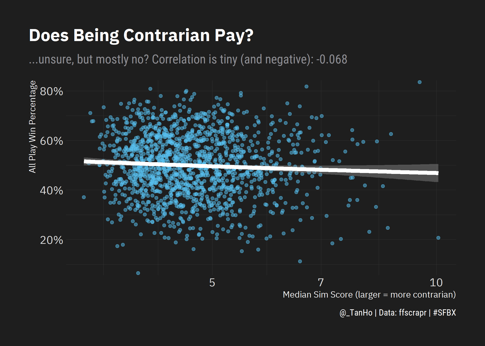
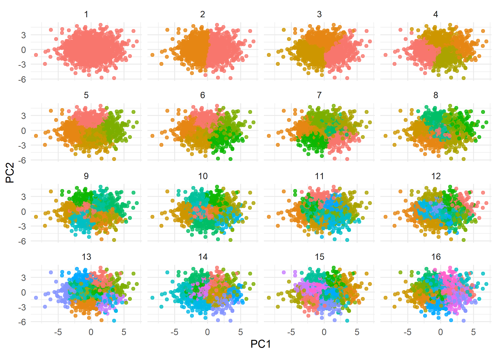
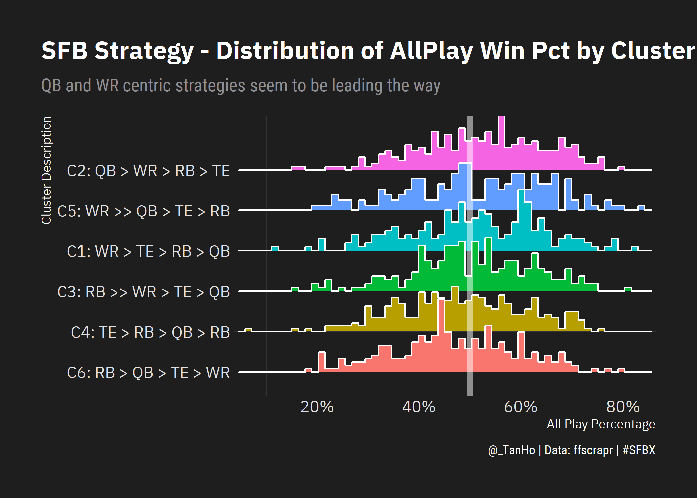

SFBX Strategy Similarities
================
Tan Ho
2021-05-30

``` r
suppressPackageStartupMessages({
  
  ## File IO ##
  library(arrow)
  library(here)
  
  
  # Data Manipulation
  library(tidyverse) 
  library(stringr)
  library(stringi)
  library(furrr)
  
  ## Modelling ##
  library(tidymodels)
  library(tidytext)
  
  ## Plotting ##
  library(ggridges)
  library(gghighlight)
  library(hrbrthemes)
  
  ## Report ##
  library(knitr)
  library(rmarkdown)
  # library(DT)
    
  library(ffscrapr) 
  
  suppressMessages(hrbrthemes::import_plex_sans())
  options(dplyr.summarise.inform = FALSE)
})
```

## Data Import

``` r
df_draft <- open_dataset(here("data/draft")) %>% 
  filter(year == 2020, sfb_type == "official") %>% 
  collect() %>% 
  filter(!player_id %in% c("0000", "0801")) %>% 
  mutate(franchise_name = str_remove(franchise_name,"<[^>]*>"),
         franchise_name = stri_trans_general(franchise_name,"latin-ascii"))

df_standings <- open_dataset(here("data/standings")) %>% 
  filter(year == 2020, sfb_type == "official") %>% 
  collect() %>% 
  mutate(franchise_name = str_remove(franchise_name,"<[^>]*>"),
         franchise_name = stri_trans_general(franchise_name,"latin-ascii"))
```

## Data Cleaning

``` r
df_adp <- df_draft %>% 
  group_by(league_id,division, pos) %>% 
  mutate(pos_rank = rank(overall, ties.method = "first")) %>% 
  group_by(player_id, player_name, pos, team) %>% 
  mutate(
    overall_adp = mean(overall, na.rm = TRUE) %>% round(1),
    pos_adp = mean(pos_rank, na.rm = TRUE) %>% round(1)
  ) %>% 
  ungroup() %>% 
  mutate(
    pos_adp = case_when(player_id == "11151" ~ 50, TRUE ~ pos_adp)
  ) %>% 
  group_by(franchise_name, pos) %>% 
  mutate(
    pos_slot = rank(pos_adp, ties.method = "first")
  ) %>% 
  ungroup() %>% 
  select(
    division_name, franchise_name, pos, pos_slot, player_id, player_name,team, pos_adp
  )

posadp_wide <- df_adp %>%
  select(division_name,franchise_name,pos,pos_slot,pos_adp) %>%
  mutate(pos = fct_relevel(pos,c("QB","RB","WR","TE"))) %>%
  arrange(franchise_name,pos,pos_slot) %>%
  filter((pos %in% c("QB","TE") & pos_slot <=3) | (pos %in% c("RB","WR") & pos_slot <=5)) %>%
  pivot_wider(names_from = c(pos,pos_slot),
              names_sep = "",
              # values_fill = 100, # if they haven't taken one of these slots, assume posadp of 100
              values_from = pos_adp) %>%
  mutate(across(c(starts_with("QB"),starts_with("TE")),replace_na,50),
         across(c(starts_with("RB"),starts_with("WR")),replace_na,100)) %>% 
  select(division_name,
         franchise_name,
         starts_with("QB"),
         starts_with("RB"),
         starts_with("WR"),
         starts_with("TE"))
```

## PCA

Create recipe for PCA preprocessing of the Positional ADP wide data.

``` r
pca_rec <- recipe(~.,data = posadp_wide) %>%
  update_role(division_name,franchise_name, new_role = "id") %>%
  step_normalize(all_predictors()) %>%
  step_pca(all_predictors(), threshold = 0.8)

pca_prep <- prep(pca_rec)
tidied_pca <- tidy(pca_prep,2)

pca_juice <- bake(pca_prep, new_data = NULL)
```

How much variance is explained by each PCA component?

``` r
pca_varexplained <- pca_rec %>%
  prep() %>% 
  pluck("steps",2,"res","sdev") %>%
  as_tibble_col("sdev") %>%
  mutate(component = unique(tidied_pca$component),
         percent_var = sdev^2/sum(sdev^2),
         cumulative_var = cumsum(percent_var)) %>% 
  select(component,sdev,percent_var,cumulative_var)

pca_factors <- tidied_pca %>%
  filter(component %in% paste0("PC", 1:8)) %>%
  group_by(component) %>%
  top_n(8, abs(value)) %>%
  ungroup() %>%
  mutate(terms = reorder_within(terms, abs(value), component))

plot_pcafactors <- pca_factors %>% 
  ggplot(aes(abs(value), terms, fill = ifelse(value > 0,"Late","Early"))) +
  geom_col() +
  facet_wrap(~component, scales = "free_y", nrow = 2) +
  scale_y_reordered() +
  labs(
    title = "SFBX Strategic Spectrums",
    subtitle = "Important Factors for each Principal Component",
    x = "Importance of Factor to PC Score",
    y = NULL, 
    fill = "Early or Late Pos ADP",
    caption = "Each PC has a mirror opposite!"
  ) +
  hrbrthemes::theme_modern_rc(base_family = "IBM Plex Sans") +
  theme(strip.text = element_text(colour = "white")) +
  theme(
    legend.position = "bottom",
    plot.title.position = "plot"
  ) + 
  NULL

plot_pcafactors
```

<!-- -->

We can use the above plot to interpret the main decisions that drive
each principal component - both in the positive and negative directions.

``` r
pca_descriptions <- tribble(
  ~'component',~"Positive",~"Negative",
  "PC1", "Punt RB for WR", "Punt WR for RB",
  "PC2", "Punt RB for TE", "Punt TE for RB",
  "PC3", "Punt QB for RB/TE", "Punt RB/TE for QB",
  "PC4", "RB Depth + Early TE over QB Depth", "QB Depth over RB/TE depth",
  "PC5", "Anchor WRs", "Anchor RBs",
  "PC6", "Value QBs and Depth", "Reaching on QBs and depth RB/WR",
  "PC7", "Late RB1/QB2", "Early RB1/QB2",
  "PC8", "Anchor WR1/QB1 then reaches", "Reach on WR1/QB1 and values on depth") %>% 
  pivot_longer(c(-'component'),names_to = "effect_direction",values_to = "effect_description")

pca_descriptions
```

    ## # A tibble: 16 x 3
    ##    component effect_direction effect_description                  
    ##    <chr>     <chr>            <chr>                               
    ##  1 PC1       Positive         Punt RB for WR                      
    ##  2 PC1       Negative         Punt WR for RB                      
    ##  3 PC2       Positive         Punt RB for TE                      
    ##  4 PC2       Negative         Punt TE for RB                      
    ##  5 PC3       Positive         Punt QB for RB/TE                   
    ##  6 PC3       Negative         Punt RB/TE for QB                   
    ##  7 PC4       Positive         RB Depth + Early TE over QB Depth   
    ##  8 PC4       Negative         QB Depth over RB/TE depth           
    ##  9 PC5       Positive         Anchor WRs                          
    ## 10 PC5       Negative         Anchor RBs                          
    ## 11 PC6       Positive         Value QBs and Depth                 
    ## 12 PC6       Negative         Reaching on QBs and depth RB/WR     
    ## 13 PC7       Positive         Late RB1/QB2                        
    ## 14 PC7       Negative         Early RB1/QB2                       
    ## 15 PC8       Positive         Anchor WR1/QB1 then reaches         
    ## 16 PC8       Negative         Reach on WR1/QB1 and values on depth

## Euclidean Distance Sim Scores

We can use dist() to find the most similar strategy scores based on the
PCA values (this is more useful for an app).

``` r
pca_dist <- pca_juice %>%
  select(-division_name,-franchise_name) %>%
  dist() %>%
  as.matrix(nrow = nrow(pca_juice)) %>%
  as_tibble() %>%
  set_names(pca_juice$franchise_name) %>%
  bind_cols(franchise_name = pca_juice$franchise_name,.) %>% 
  pivot_longer(cols = -franchise_name, 
               names_to = "comparison", 
               values_to = "sim_score") %>% 
  filter(
    franchise_name != comparison
  ) %>% 
  group_by(franchise_name) %>% 
  arrange(sim_score) %>% 
  ungroup()
```

Question: is being particularly contrarian a `good` thing in these
contests? We can use the median distance for each franchise as a measure
of contrarian-ness: the larger this number, the further the person was
away from the median strategy.

``` r
pca_dist_median <- pca_dist %>% 
  group_by(franchise_name) %>% 
  summarise(
    median_sim_score = median(sim_score)
  ) %>% 
  ungroup() %>% 
  left_join(df_standings %>% select(franchise_name, allplay_winpct),
            by = "franchise_name")

cor_contrarian <- cor(pca_dist_median$median_sim_score,pca_dist_median$allplay_winpct)

pca_dist_median %>% 
  ggplot(aes(x = median_sim_score, y = allplay_winpct)) + 
  geom_point(alpha = 0.5) +
  geom_smooth(size = 2, color = "white") +
  # scale_color_distiller(type = "div", direction = 1) +
  # scale_color_brewer(type = "div") +
  scale_y_percent() + 
  scale_x_log10() +
  xlab("Median Sim Score (larger = more contrarian)") + 
  ylab("All Play Win Percentage") + 
  labs(
    title = "Does Being Contrarian Pay?",
    subtitle = glue::glue("...not really? Correlation is tiny (and negative): {round(cor_contrarian,3)}"),
    caption = "@_TanHo | Data: ffscrapr | #SFBX"
  ) +
  theme_modern_rc(base_family = "IBM Plex Sans") +
  theme(
    plot.title.position = "plot",
    legend.position = "none"
  )
```

    ## `geom_smooth()` using method = 'gam' and formula 'y ~ s(x, bs = "cs")'

<!-- -->

It doesn’t look like being more contrarian really pays off - there’s a
definite downward trend, and it’s hilarious to see Anthony and Hilal
counterbalancing each other at the far end of the contrarian scale.

## K-Means clustering

``` r
df_kmeans <- pca_juice %>%
  select(-division_name,-franchise_name) %>%
  nest(data = everything()) %>%
  crossing(k = 1:16) %>%
  mutate(kclust = map2(data,k,kmeans),
         tidied = map(kclust,tidy),
         glanced = map(kclust,glance),
         augmented = map2(kclust,data,augment))

clusters <- df_kmeans %>%
  unnest(cols = c(tidied))

assignments <- df_kmeans %>% 
  unnest(cols = c(augmented))

clusterings <- df_kmeans %>%
  unnest(cols = c(glanced))

p1 <- assignments %>%
  ggplot(aes(x = PC1, y = PC2)) +
  geom_point(aes(color = .cluster), alpha = 0.8) +
  facet_wrap(~ k) +
  theme_minimal() +
  theme(
    legend.position = "none",
    plot.title.position = "plot"
  )

p1 
```

<!-- -->

``` r
ggplot(clusterings, aes(k, tot.withinss)) +
  geom_line() +
  geom_point() +
  labs(title = "How many clusters should we have?",
       subtitle = "Variance within each cluster - decreasing as more clusters are added") +
  theme_modern_rc(base_family = "IBM Plex Sans") + 
  theme(
    legend.position = "none",
    plot.title.position = "plot"
  )
```

<!-- -->

``` r
set.seed(613)

df_kmeans_6 <- pca_juice %>% 
  select(-division_name, -franchise_name) %>%
  nest(data = everything()) %>%
  mutate(
    k = 6,
    kclust = map2(data,k,kmeans),
    tidied = map(kclust,tidy),
    glanced = map(kclust,glance),
    augmented = map2(kclust,data,augment))

df_clusterings <- df_kmeans_6 %>% 
  unnest(tidied)

df_assignments <- df_kmeans_6['augmented'] %>% 
  unnest(1) %>% 
  bind_cols(
    pca_juice %>% select(division_name,franchise_name),
    .
  )

results <- df_assignments %>% 
  left_join(df_standings, by = "franchise_name") %>% 
  select(ends_with('name'),
         cluster = .cluster,
         points_for,
         potential_points,
         starts_with("PC"),
         starts_with('h2h'),
         starts_with('allplay'),
         ) %>% 
  arrange(desc(points_for))

cluster_descriptions <- df_clusterings %>% 
  select(cluster, starts_with("PC")) %>% 
  pivot_longer(-cluster,names_to = "component") %>% 
  mutate(effect_strength = case_when(abs(value) > 2 ~ "Very strong",
                                     abs(value) > 1 ~ "Strong",
                                     abs(value) > 0.5 ~ "Moderate",
                                     TRUE ~ "Weak"),
         effect_strength = suppressWarnings(fct_relevel(effect_strength,
                                                        c("Very strong","Strong","Moderate","Weak"))),
         effect_direction = ifelse(value > 0, "Positive","Negative")) %>% 
  arrange(cluster,desc(abs(value))) %>%
  left_join(pca_descriptions, by = c("component","effect_direction")) %>%
  filter(!is.na(effect_description)) %>% 
  filter(effect_strength!="Weak") %>% 
  group_by(cluster,effect_strength) %>% 
  summarise(effect_description = paste(effect_description,collapse = ", ")) %>% 
  summarise(effect_description = paste(effect_strength, effect_description, sep = ": ", collapse = "; "))

results_summary <- results %>% 
  group_by(cluster) %>% 
  summarise(
    franchise_count = n(),
    # across(starts_with("PC"), mean),
    across(contains('points'), median),
    across(contains("wins"), mean)
  ) %>% 
  ungroup() %>% 
  left_join(
    y = .,
    x = cluster_descriptions, 
    by = "cluster") %>% 
  arrange(desc(points_for))

manual_cluster_descriptions <- tribble(
  ~ cluster, ~ cluster_description,
  "1", "C1: WR > TE > RB > QB",
  "2", "C2: QB > WR > RB > TE",
  "3", "C3: RB >> WR > TE > QB",
  "4", "C4: TE > RB > QB > WR",
  "5", "C5: WR >> QB > TE > RB",
  "6", "C6: RB > QB > TE > WR"
)

results %>%
  left_join(
    results_summary %>% select(cluster, mean_allplay_wins = allplay_wins),
    by = "cluster"
  ) %>% 
  left_join(
    manual_cluster_descriptions,
    by = "cluster"
  ) %>% 
  mutate(
    cluster_description = fct_reorder(cluster_description, mean_allplay_wins)
  ) %>% 
  ggplot(aes(x = allplay_winpct, y = cluster_description, fill = cluster_description)) + 
  ggridges::geom_density_ridges(
    # stat = "binline", 
    quantile_lines = TRUE,
    # bins = 60,
    bandwidth = 0.02,
    colour = 'white') +
  geom_vline(xintercept = 0.5, size = 2, alpha = 0.5, color = "white") + 
  theme_modern_rc(base_family = "IBM Plex Sans") + 
  theme(
    legend.position = "none",
    plot.title.position = "plot"
  ) + 
  scale_x_percent() +
  xlab("All Play Percentage")+
  ylab("Cluster Description") +
  labs(
    title = "SFB Strategy Clusters",
    subtitle = "Distribution of AllPlay Win Percentage by Cluster",
    caption = "@_TanHo | Data: ffscrapr | #SFBX"
  )
```

<!-- -->

Joe asks: what clusters do the finalists come from?

``` r
sfbx_championship <- data.frame(
  stringsAsFactors = FALSE,
  Rank = c(1L,2L,3L,4L,5L,6L,7L,8L,
           9L,10L,11L,12L,13L,14L,15L),
  Team = c("Fan - Jayme Cernicka (jcernicka)",
           "Www.nflroughdraft.com - Ray Mencio (@RoughDraftRay)","Fan-Mark Dooley(Dools_33)",
           "Dynasty football factory - Tony Leding (@DFF_Hillbilly)",
           "The Pregame HQ - Elvin Ryan (@ElvinRyan_FF)",
           "angeloanalysis.com - Brandon Angelo (@angelo_fantasy)",
           "Rookie Fever, Super Flexible, & FFBreakdown Podcast - Shane Swager (@SwagzillaZeroG)",
           "Fan - Hope Golden (@[none])",
           "Elite Seekers Podcast (@DestinationDevy) - Ben Eby (@Mr_Eby)","Fan - Mark Orns (@Mark_in_MI)",
           "Rotoballer.com - Anthony Aniano (@Aanianofantasy)",
           "Fan - Kenny Darter (@1stroundqb)",
           "Fan - Daniel Kukla (@DBK_vtd)",
           "Sirius XM, Fantasy Alarm - Jennifer Piacenti (@jenpiacenti)","Fan - Garrett Lerner (@garrettlerner)")
) %>% 
  left_join(results, by = c("Team"="franchise_name"))

manual_cluster_descriptions %>% 
  left_join(sfbx_championship, by = "cluster") %>% 
  left_join(
    results_summary %>% select(cluster, mean_allplay_wins = allplay_wins),
    by = "cluster"
  ) %>% 
  mutate(cluster_description = fct_reorder(cluster_description,mean_allplay_wins)) %>% 
  group_by(cluster_description) %>% 
  summarise(n = sum(!is.na(Rank))) %>% 
  ungroup() %>% 
  ggplot(aes(x = cluster_description, y = n, fill = cluster_description)) + 
  coord_flip() + 
  geom_col() + 
  theme_modern_rc(base_family = "IBM Plex Sans") + 
    theme(
    legend.position = "none",
    plot.title.position = "plot"
  ) + 
  xlab("Count of Top 15 Teams")+
  ylab("Cluster Description") +
  labs(
    title = "SFBX Strategy Clusters: Finalists",
    subtitle = "The 'worse' clusters made up a huge proportion of the finalists!",
    caption = "@_TanHo | Data: ffscrapr | #SFBX"
  )
```

<!-- -->

Jayme Cernicka, SFBX winner, came from cluster six!!

## How well did each cluster score on a weekly basis?

``` r
df_starters <- arrow::open_dataset(here("data/starters")) %>% 
  # filter(year == "2020") %>%
  collect() %>% 
  filter(year == 2020)

df_matchups <- df_starters %>% 
  group_by(league_id,league_name,franchise_id,franchise_name,week) %>% 
  summarise(
    points_for = sum(player_score * (starter_status == "starter"), na.rm = TRUE),
    potential_points = sum(player_score * should_start, na.rm = TRUE)
  ) %>% 
  ungroup() %>% 
  left_join(
    results %>% select(franchise_name,cluster),
    by = "franchise_name"
  )

df_matchups %>% 
  left_join(manual_cluster_descriptions, by = "cluster") %>% 
  left_join(
    results_summary %>% select(cluster, mean_allplay_wins = allplay_wins),
    by = "cluster"
  ) %>% 
    mutate(cluster_description = fct_reorder(cluster_description,mean_allplay_wins)) %>% 
  filter(!is.na(cluster_description)) %>% 
  ggplot(aes(x = points_for, y = cluster_description, fill = cluster_description)) + 
  ggridges::geom_density_ridges(
    # stat = "binline",
    quantile_lines = TRUE,
    # bins = 100,
    bandwidth = 1,
    colour = 'white') +
  # geom_vline(xintercept = 0.5, size = 2, alpha = 0.5, color = "white") + 
  theme_modern_rc(base_family = "IBM Plex Sans") + 
  theme(
    legend.position = "none",
    plot.title.position = "plot"
  ) + 
  coord_cartesian(xlim = c(50,250)) +
  # scale_x_percent() +
  xlab("Points For")+
  ylab("Cluster Description") +
  labs(
    title = "SFB Strategy Clusters",
    subtitle = "Distribution of Weekly Points For by Cluster",
    caption = "@_TanHo | Data: ffscrapr | #SFBX"
  )
```

<!-- -->

Clusters don’t really explain week-to-week scoring, much.
